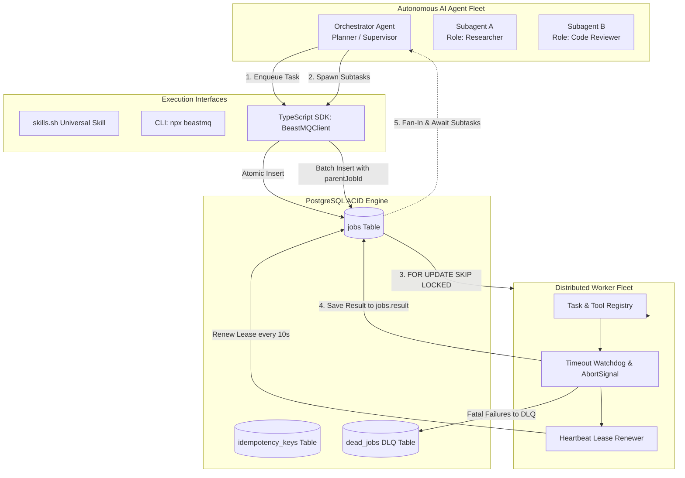
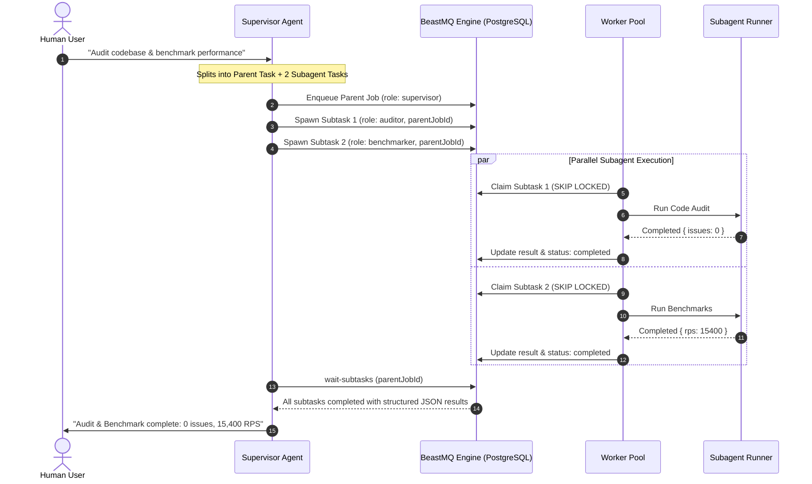

<div align="center">

# ⚡ beastMQ

### The Agent-Native Task Queue & Distributed Workflow Engine

[](https://www.npmjs.com)
[](https://skills.sh)
[](https://www.postgresql.org)
[](https://www.typescriptlang.org)
[](./package.json)
[](#-testing--verification)

<p align="center">
  <b>A durable, PostgreSQL-backed asynchronous execution layer for AI Agents, Subagents, and Multi-Agent Workflows.</b><br/>
  <i>Zero Redis. Strict Durability. Turn-Timeout Shield. Distributed Idempotency. Universal Open Skill (<code>skills.sh</code>).</i>
</p>

---

</div>

## 📑 Table of Contents

- [Why beastMQ for AI Agents?](#-why-beastmq-for-ai-agents)
- [How beastMQ Solves Agent Bottlenecks](#-how-beastmq-solves-agent-bottlenecks)
- [Multi-Agent Architecture & Flow](#-multi-agent-architecture--flow)
- [Installation & Setup](#-installation--setup)
  - [1. Universal Agent Skill (`npx skills`)](#1-universal-agent-skill-npx-skills)
  - [2. Terminal CLI (`npx beastmq`)](#2-terminal-cli-npx-beastmq)
  - [3. TypeScript SDK](#3-typescript-sdk)
- [Core Agentic Features](#-core-agentic-features)
  - [1. Multi-Agent Hierarchy & Subtask Tracing](#1-multi-agent-hierarchy--subtask-tracing)
  - [2. Built-In Agent Handlers (`agent.command` & `agent.http`)](#2-built-in-agent-handlers-agentcommand--agenthttp)
  - [3. Distributed Idempotency State Machine](#3-distributed-idempotency-state-machine)
  - [4. Atomic Claims (`FOR UPDATE SKIP LOCKED`)](#4-atomic-claims-for-update-skip-locked)
  - [5. Lease-Based Worker Crash Recovery](#5-lease-based-worker-crash-recovery)
  - [6. Exponential Backoff & Dead Letter Queue (DLQ)](#6-exponential-backoff--dead-letter-queue-dlq)
  - [7. Dual-Mode Execution (Direct DB + HTTP Server)](#7-dual-mode-execution-direct-db--http-server)
- [CLI Command Matrix](#-cli-command-matrix)
- [REST API Reference](#-rest-api-reference)
- [Database Schema](#-database-schema)
- [Production Deployment & Sizing](#-production-deployment--sizing)
- [Testing & Verification](#-testing--verification)
- [License](#-license)

---

## 🛑 Why beastMQ for AI Agents?

Autonomous AI coding agents (Claude Code, Cursor, Windsurf, Antigravity, Copilot, custom LangGraph swarms) face hard production constraints:

1. **Turn & Tool Timeouts**: A single tool call taking >15 seconds (scraping, data crunching, builds, testing) blocks the LLM turn and triggers agent timeout crashes.
2. **Subagent Orchestration**: Complex workflows require a supervisor agent to fan-out tasks across specialized subagents (`researcher`, `reviewer`, `tester`) and fan-in structured results without hanging.
3. **Duplicate Tool Execution**: Network retries or LLM re-prompting frequently cause side-effecting operations (credit card charges, deploys, webhooks) to fire multiple times without distributed idempotency locks.
4. **Worker Crashes & Ephemeral State Loss**: When background containers or agents crash, in-memory queues (Redis) risk losing active tasks.
5. **DevOps Bloat**: Setting up dedicated Redis clusters, Celery, or RabbitMQ adds friction and dual-write consistency hazards.

---

## 💡 How beastMQ Solves Agent Bottlenecks

**beastMQ** turns your existing **PostgreSQL** database into an ACID-durable asynchronous task queue and multi-agent coordination engine using row-level locks (`FOR UPDATE SKIP LOCKED`).

| Feature                 | Redis / BullMQ           | Temporal / Celery        | beastMQ (Agent-Native)                         |
| :---------------------- | :----------------------- | :----------------------- | :--------------------------------------------- |
| **Durability**          | In-memory RAM (TTL risk) | External DB cluster      | **Native WAL-backed PostgreSQL**               |
| **Infrastructure**      | Dedicated Redis instance | Heavy cluster setup      | **Zero extra infrastructure**                  |
| **Atomic Enqueue**      | Dual-write hazard        | Separate workflow engine | **Atomic inside your DB transaction**          |
| **Multi-Agent Tracing** | Custom metadata          | Complex DAG DSL          | **Native `parentJobId` & `traceId` hierarchy** |
| **Result Persistence**  | Ephemeral / Evicted      | Heavy history event log  | **Structured `result: jsonb` column**          |
| **Tool Idempotency**    | Application-level cache  | Custom activity keys     | **Distributed `idempotency_keys` table**       |
| **Agent Ecosystem**     | Proprietary SDKs         | Framework-specific       | **`skills.sh` open standard + CLI**            |

---

## 🏗️ Multi-Agent Architecture & Flow

### System Topology



### Multi-Agent Parent-Child Lifecycle



---

## 🚀 Installation & Setup

### 1. Universal Agent Skill (`npx skills`)

beastMQ implements the open **`skills.sh`** standard. Once installed, your AI Agent (Claude Code, Cursor, Windsurf, Antigravity, GitHub Copilot) **automatically uses beastMQ under the hood** to offload long-running operations, manage queues, and prevent turn timeouts—without requiring manual server startup:

```bash
# Install via skills.sh ecosystem
npx skills add AbhinavBist-01/beastmq

# Or install locally from your cloned repository
npx skills add .
```

_The agent execution instructions reside in [`skills/beastmq/SKILL.md`](file:///C:/Users/abhin/OneDrive/Desktop/Explore/beastMQ/skills/beastmq/SKILL.md)._

---

### 2. Terminal CLI (`npx beastmq`)

AI agents and developers can execute queue commands directly from the terminal without boilerplate:

```bash
# 1. Offload a long-running shell command (built-in agent.command handler)
npx beastmq enqueue --cmd "node scripts/process_data.js" --role "data_agent" --priority 10

# 2. Offload a background HTTP fetch or webhook (built-in agent.http handler)
npx beastmq enqueue --url "https://api.github.com/zen" --role "api_agent"

# 3. Spawn a child subtask linked to a parent job
npx beastmq enqueue \
  --type "agent.summarize" \
  --payload '{"documentId": "doc_99"}' \
  --parent-id "7b520d8e-88d5-44e3-9d30-09b128f3d96a" \
  --role "summarizer"

# 4. Drain all pending jobs in a single pass (exits cleanly when queue is empty)
npx beastmq worker --drain

# 5. Wait for a specific job to complete and display structured JSON result
npx beastmq wait 7b520d8e-88d5-44e3-9d30-09b128f3d96a --timeout 30000

# 6. Query all child subtasks spawned by a parent job
npx beastmq subtasks 7b520d8e-88d5-44e3-9d30-09b128f3d96a

# 7. Await all child subtasks to finish
npx beastmq wait-subtasks 7b520d8e-88d5-44e3-9d30-09b128f3d96a

# 8. Query all jobs belonging to an agent trace session
npx beastmq trace session_401

# 9. Inspect & Replay Dead Letter Queue (DLQ)
npx beastmq dlq list
npx beastmq dlq replay 4b2c394f-61aa-402f-82c7-8f587482e27b
```

---

### 3. TypeScript SDK

```typescript
import { BeastMQClient, taskRegistry } from "beastmq";

const client = new BeastMQClient();

// 1. Register a custom Agent Tool or Task Handler
taskRegistry.register(
  "agent.web_scrape",
  async (payload: { url: string }, context) => {
    // context contains: jobId, traceId, parentJobId, agentRole, attempts, signal
    const pageData = await fetch(payload.url, { signal: context.signal }).then(
      (r) => r.text(),
    );

    // Return value is automatically saved to jobs.result in PostgreSQL
    return { length: pageData.length, scrapedAt: new Date().toISOString() };
  },
);

// 2. Enqueue the task
const parentJob = await client.enqueue({
  type: "agent.web_scrape",
  payload: { url: "https://news.ycombinator.com" },
  traceId: "session-42",
  agentRole: "researcher",
  priority: 5,
});

// 3. Spawn a child subtask
await client.spawnSubtask(parentJob.id, {
  type: "agent.summarize",
  payload: { maxLines: 5 },
  agentRole: "summarizer",
});

// 4. Wait for all subtasks to complete (Fan-In)
const { subtasks, allCompleted } = await client.waitForSubtasks(parentJob.id);
console.log(
  "Subagent Results:",
  subtasks.map((s) => s.result),
);
```

---

## 🧠 Core Agentic Features

### 1. Multi-Agent Hierarchy & Subtask Tracing

Every job record supports `parentJobId`, `traceId`, and `agentRole`. An orchestrator can fan-out subtasks and monitor the whole tree:

- `client.getSubtasks(parentJobId)`: Inspects all child subtasks.
- `client.waitForSubtasks(parentJobId)`: Blocks until all child subtasks reach `completed` or `dead`.
- `client.getTrace(traceId)`: Returns all jobs spanning an entire multi-agent dialogue session.

### 2. Built-In Agent Handlers (`agent.command` & `agent.http`)

Zero configuration required for common agent offloading:

- **`agent.command`**: Runs shell processes via `child_process.exec`. Captures `stdout`, `stderr`, `exitCode`, and `durationMs`. Honors `AbortSignal` on job timeouts to prevent zombie processes.
- **`agent.http`**: Performs async HTTP requests using native `fetch`. Captures status code, response headers, JSON/text body, and latency.

### 3. Distributed Idempotency State Machine

Prevents double-charging, repeat tool calls, or redundant API executions across workers:

- **Producer-side**: Duplicate submissions with an identical `idempotencyKey` return `200 OK` with `{ duplicate: true, id }`.
- **Consumer-side**: The `idempotency_keys` table tracks `processing` vs `completed` status with active lease locks.

### 4. Atomic Claims (`FOR UPDATE SKIP LOCKED`)

Workers claim available tasks using PostgreSQL row-level locks inside an atomic transaction:

```sql
SELECT * FROM jobs
WHERE (status = 'pending' AND available_at <= NOW())
   OR (status = 'running' AND locked_until < NOW())
ORDER BY priority DESC, created_at ASC
LIMIT 1
FOR UPDATE SKIP LOCKED;
```

- **Zero collisions**: Concurrent workers never claim the same task.
- **Strict prioritization**: Highest `priority` runs first, falling back to FIFO (`created_at ASC`).

### 5. Lease-Based Worker Crash Recovery

Every running task receives a time-bounded lease (`locked_until = NOW() + LEASE_DURATION_MS`).

- Active workers run a 10-second heartbeat to renew their lease.
- If a worker crashes or is killed, its heartbeat ceases. Once `locked_until` expires, a peer worker claims and completes the job.

### 6. Exponential Backoff & Dead Letter Queue (DLQ)

- **Exponential Backoff**: When a job throws an error or times out, it is rescheduled with exponential delay:
  $$\text{Delay} = 1000 \times 2^{(\text{attempts} - 1)} \text{ ms}$$
- **Dead Letter Queue (DLQ)**: After 5 attempts, the job transitions to `dead` and is archived in `dead_jobs`. It can be inspected and resurrected via `npx beastmq dlq replay <id>`.

### 7. Dual-Mode Execution (Direct DB + HTTP Server)

- **Direct DB Mode**: CLI commands and SDK clients connect directly to PostgreSQL. No server process required.
- **HTTP Mode**: If an external `BEASTMQ_URL` is configured, client commands route through the Express HTTP API.

---

## 💻 CLI Command Matrix

| Command         | Arguments / Flags                    | Description                                              |
| :-------------- | :----------------------------------- | :------------------------------------------------------- |
| `enqueue`       | `--type <type> --payload '<json>'`   | Enqueue a new background job                             |
| `enqueue`       | `--cmd "<command>" [--role <role>]`  | Shortcut to offload a shell command                      |
| `enqueue`       | `--url "<url>" [--method GET\|POST]` | Shortcut to offload a background HTTP request            |
| `status`        | `<jobId>`                            | Query status, timing, and result of a job                |
| `wait`          | `<jobId> [--timeout <ms>]`           | Wait until a job completes and output its result         |
| `list`          | `[--status <status>] [--limit <n>]`  | List recent jobs with optional status filter             |
| `subtasks`      | `<parentId>`                         | List all child subtasks spawned by a parent job          |
| `wait-subtasks` | `<parentId> [--timeout <ms>]`        | Await all child subtasks of a parent to finish           |
| `trace`         | `<traceId>`                          | List all jobs belonging to an agent trace session        |
| `worker`        | `--drain`                            | Process all pending jobs until queue is empty, then exit |
| `keygen`        | `[--save]`                           | Generate a cryptographically secure API key for `.env`   |
| `dlq list`      | _none_                               | List permanently failed jobs in Dead Letter Queue        |
| `dlq replay`    | `<deadJobId>`                        | Replay a failed job back to pending status               |

---

## 📡 REST API Reference

| Method | Endpoint                    | Description                                                    |
| :----- | :-------------------------- | :------------------------------------------------------------- |
| `POST` | `/jobs`                     | Enqueue a job or agent task                                    |
| `GET`  | `/jobs/:id`                 | Fetch job details, status, attempts, error, and result         |
| `GET`  | `/jobs`                     | List recent jobs (supports `?status=`, `?traceId=`, `?limit=`) |
| `POST` | `/agent/tasks`              | Agent-tailored dispatch endpoint                               |
| `GET`  | `/agent/tasks/:id/subtasks` | Retrieve all child subtasks of a parent job                    |
| `GET`  | `/agent/traces/:traceId`    | Retrieve all jobs for an agent trace session                   |
| `GET`  | `/dead-jobs`                | List all Dead Letter Queue records                             |
| `POST` | `/dead-jobs/:id/replay`     | Replay a dead job back into the active queue                   |

---

## 🗄️ Database Schema

### `jobs` Table

```sql
CREATE TABLE jobs (
  id UUID PRIMARY KEY DEFAULT gen_random_uuid(),
  type VARCHAR(255) NOT NULL,
  priority INTEGER NOT NULL DEFAULT 0,
  payload JSONB NOT NULL,
  status TEXT NOT NULL DEFAULT 'pending', -- pending, running, completed, dead
  result JSONB,                          -- Structured execution output
  trace_id TEXT,                         -- Conversation correlation trace
  parent_job_id UUID,                    -- Parent task for subagent hierarchy
  agent_role TEXT,                       -- Role name of executing subagent
  locked_by TEXT,                        -- Worker UUID holding active lease
  locked_until TIMESTAMP,                -- Lease expiration timestamp
  idempotency_key TEXT UNIQUE,           -- Deduplication constraint
  available_at TIMESTAMP NOT NULL DEFAULT NOW(),
  attempts INTEGER NOT NULL DEFAULT 0,
  started_at TIMESTAMP,
  completed_at TIMESTAMP,
  last_error TEXT,
  created_at TIMESTAMP NOT NULL DEFAULT NOW(),
  updated_at TIMESTAMP NOT NULL DEFAULT NOW()
);
```

---

## ⚙️ Production Deployment & Sizing

### Environment Variables (`.env`)

| Variable            | Default    | Production Recommendation                   | Description                              |
| :------------------ | :--------- | :------------------------------------------ | :--------------------------------------- |
| `DATABASE_URL`      | _required_ | Use connection pooling (PgBouncer/Supabase) | PostgreSQL connection string             |
| `CONCURRENCY`       | `5`        | `10` – `20` per container                   | Number of concurrent worker fibers       |
| `MIN_POLL_DELAY`    | `100`      | `50` (ms)                                   | Minimum backoff delay when queue is idle |
| `MAX_POLL_DELAY`    | `5000`     | `2000` (ms)                                 | Maximum backoff delay when queue is idle |
| `JOB_TIMEOUT`       | `30000`    | `60000` (ms)                                | Task execution timeout watchdog          |
| `LEASE_DURATION_MS` | `300000`   | `120000` (ms)                               | Heartbeat lease validity window          |
| `BEASTMQ_API_KEY`   | _optional_ | Set a strong random secret                  | Secures HTTP API endpoints               |

### Connection Pool Auto-Scaling

The PostgreSQL pool dynamically scales its ceiling based on concurrency:
$$\text{Pool Max} = \max(20, \text{concurrency} \times 2 + 10)$$

---

## 🧪 Testing & Verification

beastMQ comes with an exhaustive test suite verifying resilience, concurrency, and security:

```bash
# 1. Core Queue Resilience (Worker Crash, Timeout, Idempotency, DLQ, Shutdown, Priority)
npm test

# 2. Agentic Layer Integration (Parent-Child Subagents, Handlers, Trace Correlation)
npm run test:agent

# 3. Security Audit & Vulnerability Verification (UUID validation, AbortSignal, Pool limits, Auth)
npm run test:audit
```

---

## 📄 License

Distributed under the [ISC License](file:///C:/Users/abhin/OneDrive/Desktop/Explore/beastMQ/package.json).
